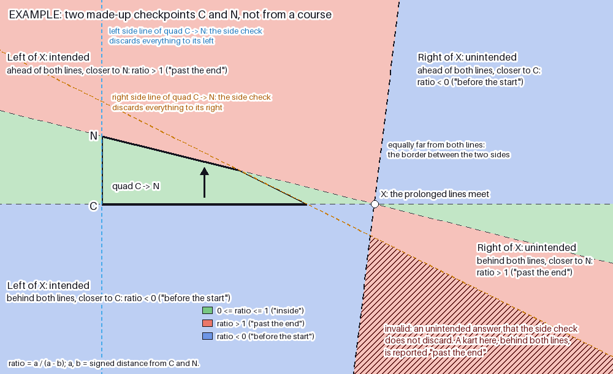
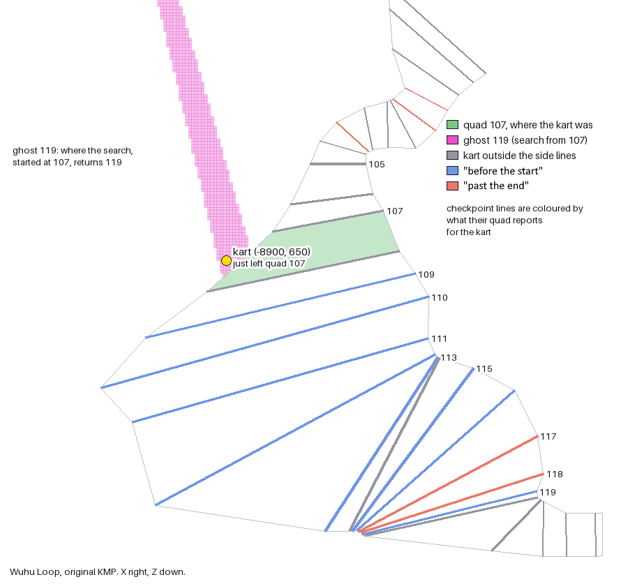
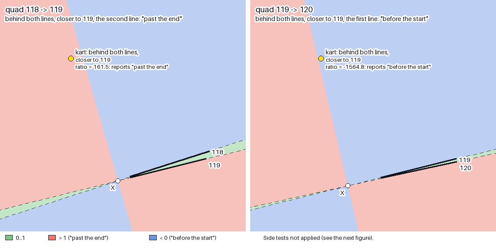
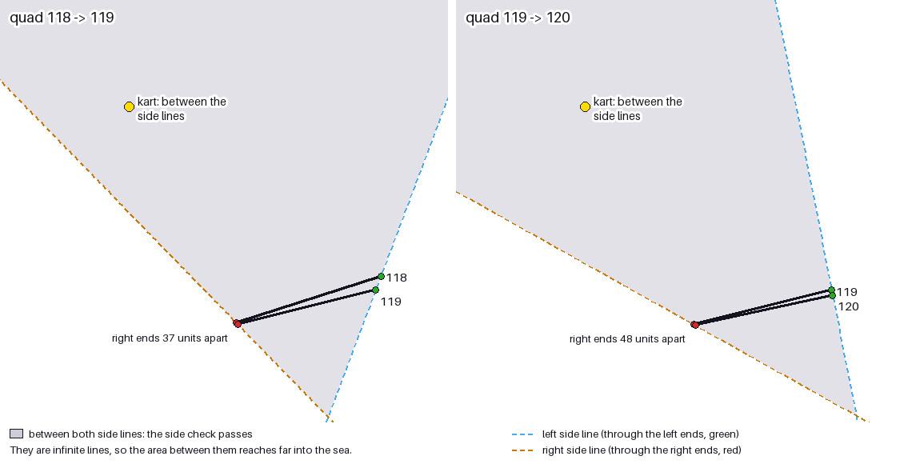
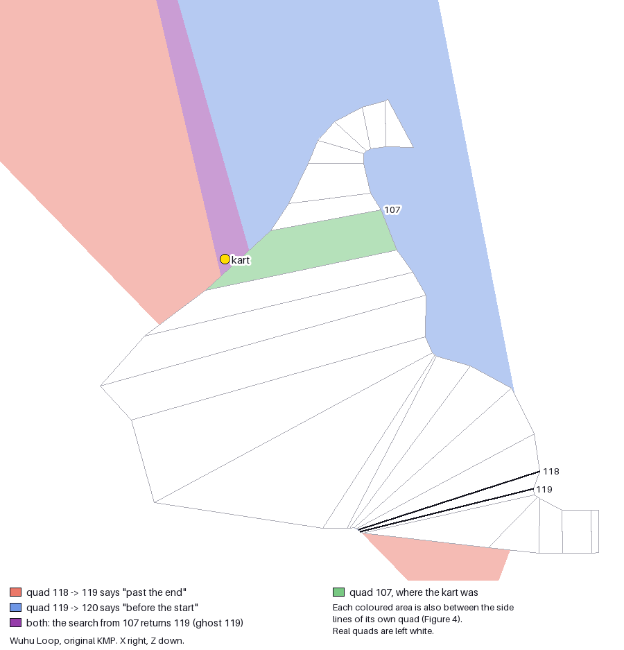

# Ghost checkpoints

- Status: verified
- Asked: Let's do a research task on MK7 checkpoint glitches. When version 1.1 released, it included patches to a few course KMPs to
  fix a few unintended respawn shortcuts. [...] WuhuIsland1 is way more strange, if you out of bounds to the -X area near
  checkpoints 39-42 of group 3, then you respawn in respawn point 32 instead of the intended 27-28. The fix involved moving the
  coordinates of the checkpoints around that place but the change does not really explain why the issue happens. See how
  checkpoints are handled and why the explained bug can happen, you can get a hint on the checkpoint parameters from
  https://github.com/PabloMK7/EveryFileExplorer
- Base commit: e8aa931bb403027cf47c6505c0cf17ddfcc29abd
- Images: `eur2` (sha1 e3edb9771fea3149ddfe309e3ca8453046ef8a95); `eur0` only to show what v1.1 changed in
  `FindRecursiveSector`; `dlp` only as the source of names. `eur2` also run in Azahar (the installed game with its v1.2
  update) for Finding 8.

## Contents

- [Overview](#overview): what was researched and found, for readers new to the topic
  - [Checkpoints, quads and respawn points](#checkpoints-quads-and-respawn-points)
  - [The quad test](#the-quad-test)
  - [Gap bridging and ghost checkpoints](#gap-bridging-and-ghost-checkpoints)
  - [Why far quads can pass the bridging test](#why-far-quads-can-pass-the-bridging-test)
  - [Which results the game accepts](#which-results-the-game-accepts)
  - [A ghost checkpoint usually lasts one frame](#a-ghost-checkpoint-usually-lasts-one-frame)
  - [Chains of ghost checkpoints](#chains-of-ghost-checkpoints)
  - [Ghost checkpoints for a kart inside a quad](#ghost-checkpoints-for-a-kart-inside-a-quad)
  - [What v1.1 changed](#what-v11-changed)
  - [The Wuhu Loop shortcut](#the-wuhu-loop-shortcut)
  - [Checking a course for ghost checkpoints](#checking-a-course-for-ghost-checkpoints)
  - [Ghost checkpoints on other courses](#ghost-checkpoints-on-other-courses)
- [Glossary](#glossary): the classes, members and enums involved, with their offsets; the
  [functions](#functions) and [data](#data) tables with addresses
- [Findings](#findings): each claim with its evidence
  - [Sources and method](#sources-and-method)
  - [1. The quad test](#1-the-quad-test)
  - [2. The search](#2-the-search)
  - [3. What v1.1 changed in the bridge](#3-what-v11-changed-in-the-bridge)
  - [4. From the search result to the respawn point](#4-from-the-search-result-to-the-respawn-point)
  - [5. Wuhu Loop: course data and model results](#5-wuhu-loop-course-data-and-model-results)
  - [6. The v1.1 KMP of Wuhu Loop](#6-the-v11-kmp-of-wuhu-loop)
  - [7. The model: ghost_checkpoints.py](#7-the-model-ghost_checkpointspy)
  - [8. In game](#8-in-game)
- [Confidence](#confidence): what is certain, what is likely, what is a guess
- [Open questions](#open-questions): what was not resolved

## Overview

To know where a kart is on the course, the game searches for the area between two checkpoints that the kart is in. To
cover small gaps between these areas, the search can also return a checkpoint whose area the kart is not in, sometimes
far away along the course. This document calls these **ghost checkpoints**. A kart mostly gets a ghost checkpoint off
the track, where it is in none of these areas, and when the game accepts it as the kart's checkpoint, the respawn that
follows uses that checkpoint's respawn point instead of the one it should: a respawn glitch. The research started from
a known respawn shortcut on Wuhu Loop that version 1.1 fixed for online races, which is most likely one of these
([The Wuhu Loop shortcut](#the-wuhu-loop-shortcut)). In online races, version 1.1 restricts ghost checkpoints in the
code and probably loads patched course files for four courses. Offline races still have ghost checkpoints: on v1.2, a
kart moved through the air just off the track on Wuhu Loop respawned at the wrong point, as the code predicts
([What v1.1 changed](#what-v11-changed)). A tool in this folder draws the ghost checkpoints of any course
([Checking a course for ghost checkpoints](#checking-a-course-for-ghost-checkpoints)), and points to a few places on
other courses worth a closer look ([Ghost checkpoints on other courses](#ghost-checkpoints-on-other-courses)).

### Checkpoints, quads and respawn points

The course file (KMP) holds a list of **checkpoints** (its CKPT section). Each checkpoint is a line across the track,
from its **left end** to its **right end** (Point1 and Point2 in EveryFileExplorer), and names a **respawn point**
(where a kart that falls off the course is put back) and the checkpoints before and after it. The checkpoints are split
into **groups** (the CKPH section), and each group names the groups that come right before and after it; this document
always numbers the checkpoints across the whole course. Some checkpoints are **key checkpoints**, numbered by a **key
id**, and the one with key id 0 is the **finish line checkpoint**; the stretch from one key checkpoint to the next is a
**key checkpoint section**. The game only uses the X and Z coordinates; heights play no part.

A checkpoint and the one after it enclose an area, a **quad** (a "sector" in the game's code): the quad of checkpoint C
is the one that starts at C, also written C → N when the next checkpoint N matters. Every frame the game searches for
the quad the kart is in, starting from the quad it found the frame before. The checkpoint of the quad found can become
the kart's **current checkpoint**, and the current checkpoint's respawn point is where the kart respawns. When the
search finds no quad, the kart has left the course and the game starts a respawn
([Finding 4](#4-from-the-search-result-to-the-respawn-point)).

### The quad test

For the quad from checkpoint C to the next checkpoint N, the game checks two things
([Finding 1](#1-the-quad-test)):

- **Side lines.** The kart must be between the line through the left ends of C and N and the line through their right
  ends. These lines are infinite, so this can also hold far away from the quad.
- **Ratio.** `ratio = a / (a − b)`, where `a` and `b` are the kart's signed distances from the lines of C and N, also
  prolonged without end, positive in front of the line (on the side of the next checkpoint). Near the quad, 0..1 means
  inside, below 0 means "before the start" (behind C) and above 1 means "past the end" (beyond N).

The kart is in the quad when it is between the side lines and the ratio is between 0 and 1.

### Gap bridging and ghost checkpoints

The search first tests the kart's last quad. If the kart is not in it, the **main walk** goes along the course from
there, testing the quads it meets, up to 16 checkpoints forward or backward. If it finds nothing, a **fallback walk**
tries again without a distance limit, but stops at key checkpoints. If that finds nothing either, the game tests every
other quad of the course for one the kart is in ([Finding 2](#2-the-search)).

To cover small gaps between quads that do not quite meet, the walks can also return a quad the kart is **not** in. They
do so when the kart is between the side lines of both that quad and the quad before it on the walk, and:

- walking forward, the quad before it said "past the end" and this one says "before the start";
- walking backward, the quad before it said "before the start" and this one says "past the end".

This document calls this **gap bridging**, and the checkpoint of the quad returned this way a **ghost checkpoint**.
Near the track, bridging fills real gaps. But both answers can also come from quads far from the kart, and then the
ghost checkpoint has nothing to do with where the kart is. The place where the search returns a ghost checkpoint is
its **ghost area**.

### Why far quads can pass the bridging test

Take the quad C → N. The ratio does not compare the kart with the two checkpoint lines as drawn, but with these lines
prolonged without end on both sides. When the kart is behind both lines, or ahead of both, the ratio is below 0 or
above 1 depending on which line is closer: closer to C gives "before the start", closer to N gives "past the end"
([Finding 1](#1-the-quad-test)).

Two checkpoints are almost never exactly parallel, so their prolonged lines cross somewhere, at a point X off to one
side of the quad. On the side of X where the quad is, a kart driving forward meets C's line first and N's line after
it, so a kart behind both is closer to C, and the answer, "before the start", is correct. On the other side of X, the
two lines have swapped places: N's line now comes first, so a kart behind both C and N is closer to N, and the quad
says "past the end" although the kart has reached neither checkpoint.

Usually the side lines of the quad cut off the area beyond X, but depending on the shape of the quad they may not. For
example, consecutive checkpoints in a tight turn can have their ends very close together, and a side line drawn
through two such ends can point in an unexpected direction.

*Figure 1. Two made-up checkpoints C and N, not from any course, and the ratio of quad C → N over the whole plane,
ignoring the side lines. The prolonged checkpoint lines meet at X. The black dashed line through X is where a point is
equally far from both lines. The orange and light blue dashed lines are the side lines of the quad.*

The black dashed line splits the plane in two:

- **Left of X**, the quad's side, the ratio means what it should. Behind both lines the kart is closer to C: "before
  the start". Ahead of both it is closer to N: "past the end".
- **Right of X** the closer line is the other one, so the answers swap. Behind both lines gives "past the end", ahead of
  both gives "before the start".

The side lines discard most of the right of X. What they leave is the invalid corner: a kart there is behind both
checkpoints and between the side lines, and the quad reports "past the end". If the next quad on the walk reports
"before the start" at the same place, the walk bridges to it, and its checkpoint becomes a ghost.

### Which results the game accepts

Every result of the search, a quad the kart is in or a bridged one, goes through a last check. The game only makes the
checkpoint the kart's current checkpoint when one of these holds
([Finding 4](#accepting-the-result)):

- it is in the next or the previous key checkpoint section, any checkpoint in it. Across the finish line, only the
  finish line checkpoint itself (going forward) or the one right before it (going back) counts;
- it is next to the current checkpoint: one index before or after it in the same group;
- the current checkpoint is the last checkpoint of a group that comes right before the checkpoint's group, or the
  first checkpoint of a group that comes right after it. Then any checkpoint of that group counts, however far it is;
- the course has 3 laps and byte 0x15 of the checkpoint's CKPT entry is 1. Only Rock Rock Mountain (checkpoints 3..37)
  and Rosalina's Ice World (checkpoints 39..58) use this.

Otherwise the current checkpoint stays.

A result far along the course from the current checkpoint is a **jump**. A jump that skips a whole key checkpoint
section, a **jump across key checkpoint sections**, sets a flag on the kart, `Force_No_Lap_Completion`, and then only
the last three rules can still accept it. By its name the flag stops the lap from being completed, but what it does to
the lap was not followed. Offline the last three rules run for every kart: a jump across key checkpoint sections is
accepted when it lands on a checkpoint that one of them allows (tested in game on Wuhu Loop, Rock Rock Mountain and
Daisy Cruiser). Online, according to the user, they do not run for the karts whose data a console sends to the
others, the player's own kart among them ([Finding 8](#accepting-jumps-across-key-checkpoint-sections)).

### A ghost checkpoint usually lasts one frame

A kart that gets a ghost checkpoint off the track, in no quad, usually keeps it for one frame only. On the next frame,
the search starts from the ghost checkpoint, usually far from the kart, and finds nothing, so the game starts a respawn
([Finding 4](#4-from-the-search-result-to-the-respawn-point)). That one frame is enough: if the game accepted the ghost
checkpoint as the kart's current checkpoint, the respawn uses its respawn point instead of the one it should.

The search finds nothing because the kart is in no quad, so only a bridge could return a checkpoint, and the bridge that
gave the ghost does not happen again. It needed the answer of the quad before the ghost's on the walk from the kart's
last quad. Now the walk starts at the ghost's own quad, and the search never passes the answer of the quad it starts
from on to the next one, so the quads right next to the ghost cannot bridge ([Finding 2](#2-the-search)).

### Chains of ghost checkpoints

Quads two or more steps along the walk from the ghost's quad can still bridge, though. Then the next frame gives
another ghost checkpoint, the frame after that another one, and so on. Each of them goes through the acceptance rules
like any other result, so the current checkpoint follows only some of them. While the chain goes on, the search keeps
returning a checkpoint, so the game does not start a respawn for leaving the course. When the search finds nothing
again, the respawn starts as above. Either way, the respawn uses whatever the current checkpoint is at that moment
([Finding 4](#4-from-the-search-result-to-the-respawn-point)). The game did this on Wuhu Loop
([The Wuhu Loop shortcut](#the-wuhu-loop-shortcut)).

### Ghost checkpoints for a kart inside a quad

A kart can also get a ghost checkpoint while it is inside a quad, when it has just crossed into it from a neighbouring
quad, mostly going backward. The walk follows one direction (forward or backward) as far as it goes before it tries
the other, so it can bridge far along the course before it tests the quad the kart is in, right next to where it
started ([Finding 2](#2-the-search)).

In the places tested in game, the kart kept such a ghost checkpoint for one frame: on the next frame the search,
walking from the ghost, found the quad the kart was in, and the game made it the current checkpoint again. A respawn
would only use the ghost's respawn point if it started in that one frame, which was not tested
([Finding 8](#ghost-checkpoints-inside-a-quad)).

### What v1.1 changed

Two fixes, both only online ([Finding 3](#3-what-v11-changed-in-the-bridge)):

- **Code.** In online races that are not battles, the main walk no longer bridges at all. The new check allows
  bridging only on the quads right next to the kart's last quad, but the walk never bridges on those quads anyway: a
  bridge needs the answer of the quad before it on the walk, and the kart's last quad does not pass its answer on. The
  fallback walk still bridges at any distance, so a kart can still get a ghost checkpoint where the main walk finds
  nothing.
- **Course files.** Online, the game probably loads a patched KMP for four courses (Wuhu Loop, Maka Wuhu, DK Jungle,
  GBA Bowser Castle 1). The code that chooses the file was checked in game by making it choose the patched one offline,
  but no online race was run. Only the KMP of Wuhu Loop was examined
  ([What v1.1 changed on Wuhu Loop](#what-v11-changed-on-wuhu-loop)).

Offline races keep the original KMPs and the unrestricted bridging, so their ghost checkpoints still work. Version 1.2,
the last update and the one examined here, keeps both fixes. On v1.2, in offline races on Wuhu Loop and Dino Dino
Jungle, every ghost checkpoint and jump tested in game behaved as predicted by the tool of this folder, which
re-implements the search ([Finding 8](#8-in-game)).

### The Wuhu Loop shortcut

The known glitch: on Wuhu Loop, a kart that goes off the track on the −X side near checkpoints 39..42 of group 3
respawns at respawn point 32 instead of 27 or 28. Group 3 holds checkpoints 68..124, so these are checkpoints 107..110
in this document's numbering. Part of the fix of version 1.1 moves these checkpoints in the KMP, which does not explain
why the glitch happened.

In the original KMP, the sea on the −X side of quad 107 is covered by the ghost area of **checkpoint 119**, twelve
checkpoints further along, with respawn point **32**. The ghost area touches quad 107, so a kart that leaves quad 107
there ([Finding 4](#frame-by-frame-on-wuhu-loop), [Finding 5](#5-wuhu-loop-course-data-and-model-results)):

1. gets checkpoint 119 from the search on its first frame outside quad 107. 119 is in the next key checkpoint section,
   which counts as normal progress, so the game accepts it as the current checkpoint;
2. on the next frame, the search starts at 119, far from the kart, and finds nothing. The game starts a respawn and
   uses the respawn point of 119: 32 instead of 27 or 28.

Checkpoint 119 is the kart's current checkpoint for that one frame only, but it is enough to change the respawn point.
The game does exactly this on v1.2 offline: a kart moved in the air from quad 107 across that edge, a few units a
frame, got 119 and respawned at point 32 ([Finding 8](#ghost-checkpoints-frame-by-frame)). This is most likely the
known glitch.

The edge of quad 107 is over the sea, though. A kart driven straight from respawn point 27 towards it hit the water
about 200 units before the edge and respawned normally at 27, so a player probably has to cross the edge in the air. How
a player does that was not reproduced ([Finding 8](#where-a-kart-falls-into-the-sea)).

A kart leaving quads 108 or 109 the same way gets a ghost of checkpoint 120 instead, with respawn point 33. In about
two thirds of that ghost area, the next frame finds nothing, and the kart respawns at 33. In the other third, the
search gives a chain of ghost checkpoints ([Chains of ghost checkpoints](#chains-of-ghost-checkpoints)): in game, a
kart moved out of quad 108 got 120, then 122 and 119 in turn, frame after frame, for 53 frames. The game accepted 120
(the next key checkpoint section), rejected 122 (same key checkpoint section, not next to the current checkpoint) and
accepted 119 (next to 120), so the kart respawned at the respawn point of 119, 32, as well
([Finding 5](#5-wuhu-loop-course-data-and-model-results), [Finding 8](#ghost-checkpoints-frame-by-frame)).

*Figure 2. The kart has just left quad 107 to the sea, at (−8900, 650). The pink strip is where the search, started at
107, returns checkpoint 119. Each checkpoint line is coloured by what its quad reports for the kart's position.*

#### Why the search returns 119

The search starts at quad 107 and walks forward, testing each quad. For the kart at (−8900, 650)
([Finding 5](#5-wuhu-loop-course-data-and-model-results)):

| Step | Quad of checkpoint | It says | Bridge? |
| --- | --- | --- | --- |
| 1 | 108 | outside the side lines | no |
| 2..6 | 109..113 | before the start | no: the quad before it did not say "past the end" |
| 7 | 114 | outside the side lines | no |
| 8..9 | 115..116 | before the start | no: the quad before it did not say "past the end" |
| 10 | 117 | past the end (ratio +352) | no: it does not say "before the start" |
| 11 | 118 | past the end (ratio +161) | no: it does not say "before the start" |
| 12 | 119 | before the start (ratio −1565) | **yes**: 118 said "past the end" |

#### Why quad 118 says "past the end"

*Figure 3. The same colours for the lines of 118 → 119 (left) and 119 → 120 (right), without the side lines.*

| Quad | Lines meet at | The kart is | Closer to | Ratio | Reports |
| --- | --- | --- | --- | --- | --- |
| 118 → 119 | (−7184, 5129), 4.1° apart | on the other side of X | 119, the second line | +161.5 | "past the end" |
| 119 → 120 | (−7928, 5314), 1.5° apart | on the quad's side of X | 119, the first line | −1564.8 | "before the start" |

Checkpoints 114..120 go around a curve whose inside is almost a single point: their right ends almost meet near
(−6750, 5000). So each pair of consecutive lines crosses just beyond those ends, each at a slightly different place, and
the kart, almost equally far from all of them, falls on one side or the other from pair to pair: "before the start" up
to 116 (except 114, outside its side lines), "past the end" for 117 and 118, "before the start" again for 119. That is
the pattern the bridge accepts.

#### Why the side lines do not reject it

*Figure 4. The side lines of quad 118 → 119 (left) and 119 → 120 (right): light blue through the left ends, orange
through the right ends. Grey: between both side lines.*

The right ends of 118 and 119 are 37 units apart, those of 119 and 120 48 units (27 to 84 for the quads of 114..120). A
line through two points that close follows their small offset, not the track, and here it points out to sea. The area
between the side lines becomes a wide wedge over the sea off checkpoint 107, and the kart is inside it for both quads.

#### The ghost area

*Figure 5. Red: quad 118 → 119 says "past the end", between its side lines. Blue: quad 119 → 120 says "before the
start", between its side lines. Purple: both, which is the ghost area of 119 for a kart coming from quad 107.*

The ghost area of 119 is the overlap of the two areas: outside every quad, it passes the bridging test. And since
119 is in the next key checkpoint section after 107's, the game accepts it as the kart's current checkpoint.

#### A ghost checkpoint inside quad 110

Wuhu Loop also has places where a kart inside a quad gets a ghost checkpoint
([Ghost checkpoints for a kart inside a quad](#ghost-checkpoints-for-a-kart-inside-a-quad)): at the −X end of quad
110, over the sea, a kart coming back from quad 111 gets a ghost of checkpoint 120. In game, the kart kept it for one
frame, then got 110 again ([Finding 2](#2-the-search), [Finding 8](#ghost-checkpoints-inside-a-quad)).

#### What v1.1 changed on Wuhu Loop

- **Code.** Online, the ghost behind the shortcut is gone. Through the fallback walk, the tool still finds two ghosts,
  of checkpoints 56 and 72, but no quad touches them ([Finding 3](#3-what-v11-changed-in-the-bridge)). In game,
  with the online restriction switched on by hand, a kart leaving quads 107 and 108 respawned at 27 and 28 as intended,
  and a kart put in the ghost area of 56 still got it ([Finding 8](#the-v11-restriction)).
- **Course file.** The patched KMP moves the outer (−X) ends of checkpoints 106..111 far into the sea, so a kart leaving
  the track there stays inside a quad until it is far out. Even without the code fix, the ghost area of 119 would
  then only touch quad 105, two key checkpoint sections before 119's, a jump the game rejects. A ghost of checkpoint 120
  could still be reached, but only beyond x ≈ −10350, about 2000 units out to sea, probably out of a kart's reach
  ([Finding 6](#6-the-v11-kmp-of-wuhu-loop)). With the patched KMP loaded, the game gave the results of the tool
  ([Finding 8](#the-v11-kmp-in-game)).

Offline, the shortcut still works on v1.2: in an offline Grand Prix the game loaded the original KMP of Wuhu Loop with
bridging on, and every ghost checkpoint and jump tested there behaved as the tool predicts (above;
[Finding 8](#the-race-state)).

### Checking a course for ghost checkpoints

`ghost_checkpoints.py`, in this folder, re-implements the game's search and draws the ghost checkpoints and the
checkpoint jumps of any course over its map, with a text report of the same findings
([Finding 7](#7-the-model-ghost_checkpointspy); how to run it: [How to verify](REVIEW.md#running-ghost_checkpointspy)).
The folder `ghost-renders/` holds its images and reports for every retail course, offline and online, in the three
modes below.

The image shows the course map, the quads, the checkpoint lines (key checkpoints in cyan with their key id), the left
and right ends (green and red) and the respawn points (R*n*). On top of that:

- **Ghost areas**, filled with yellow-green to blue tones that only tell the areas apart. The largest region of each
  area is labelled with its ghost checkpoints and their respawn points. Ghosts almost always come in pairs found in the
  same places ("ghost 94, 95 - R23" on Wuhu Loop): one found walking forward, the other walking backward.
- **Overlaps** in purple: places inside two quads that are far apart along the course.
- **Jumps**: borders where a kart leaving a quad gets a checkpoint far away along the course (more than two checkpoints
  by default), drawn on the border it crosses.
- The quads from which a ghost is found are filled lightly.

Red and orange mean the same everywhere: **red** is a respawn glitch, where the game accepts a checkpoint far along the
course, forward or back, with another respawn point. **Orange** is not: either the game rejects the checkpoint (none of
the rules of [Which results the game accepts](#which-results-the-game-accepts) allows it), or it accepts it and the
respawn point stays the same. Offline, the tool applies those rules as the game does offline; online, it rejects every
jump across key checkpoint sections, as the game does for the player's own kart according to the user. The legend
lists every ghost checkpoint with the checkpoints it is found from.

The tool searches from every checkpoint, so it also shows ghost areas that only a kart arriving by a teleport or a speed
glitch can reach. Three modes choose what is shown:

- **full**: every ghost;
- **viable**: only the respawn glitches, including those that need a teleport or a speed glitch;
- **practical**: only the respawn glitches that a kart gets by driving out of a quad.

The tool does not read the course collision, so it does not know whether a kart can actually reach a place, or falls
into the water first. It does not model Maka Wuhu, which uses other rules. A ghost area is where a kart gets the ghost
checkpoint on its first frame there; what the following frames give (usually a respawn, sometimes another ghost) is not
drawn. Ghost areas only cover places outside every quad. A ghost checkpoint that a kart gets inside a quad, right after
crossing into it from a neighbouring quad, is shown as a jump on that border; the places further inside, which only a
teleport or a speed glitch reaches from the neighbouring quad, are not drawn.

### Ghost checkpoints on other courses

Only Wuhu Loop was studied in detail. On the other courses, the tool and a few tests in game point to the places
below. Except where said, they were not tested in game, and none was checked against the course collision, so whether
a player can get there is open. The images and reports of every retail course are in `ghost-renders/`.

#### Karts inside a quad

The tool's search, run at places inside a quad for a kart coming from a neighbouring quad, gives a ghost checkpoint on
12 courses: Wuhu Loop, Mario Circuit, Music Park, Rainbow Road, Piranha Plant Slide, Maka Wuhu, Airship Fortress,
Daisy Cruiser, Dino Dino Jungle, Koopa Beach, Coconut Mall and Mushroom Gorge ([Finding 2](#2-the-search)). A kart
gets there right after crossing the checkpoint line between the two quads, so only the places close to that line can
be reached by driving:

- On Mario Circuit, Music Park, Rainbow Road and Daisy Cruiser, the game rejects the ghost checkpoint there.
- On Airship Fortress (one place) and Dino Dino Jungle, it accepts it. On Dino Dino Jungle, a kart crossing back over
  checkpoint 26, 27 or 28 gets a ghost of checkpoint 36, with respawn point 2 instead of 1. In game, the kart kept it
  for one frame, then the game made the quad the kart was in its current checkpoint again. The places tested are on
  the rocks beside the road, about 200 units above it ([Finding 8](#ghost-checkpoints-inside-a-quad)).

Further from the line, where only a teleport or a speed glitch gets a kart right after crossing it, the tool finds 8
places on Mushroom Gorge and Airship Fortress where the ghost checkpoint would last: on the next frame the search
returns the quad the kart is in, but going back to it is a jump across key checkpoint sections, which the game would
reject, so the ghost would stay the current checkpoint ([Finding 2](#2-the-search)).

#### A jump across key checkpoint sections on Daisy Cruiser

Daisy Cruiser is the only retail course where the tool's `practical` mode shows a respawn glitch from a jump across key
checkpoint sections. A kart leaving the quad of the finish line checkpoint (0) into the quads of 64..68 gets one of
those as its current checkpoint, and respawns at respawn point 2 instead of 0. It is not a ghost checkpoint: the kart
is inside the quad it jumps to. The game did this offline, as the tool predicts; the place tested is probably off the
drivable deck ([Finding 8](#accepting-jumps-across-key-checkpoint-sections)). Online, according to the user, the game
rejects this jump for the player's own kart ([Which results the game accepts](#which-results-the-game-accepts)).

#### The other patched courses

Online, the game probably also loads patched KMPs for Maka Wuhu, DK Jungle and GBA Bowser Castle 1
([What v1.1 changed](#what-v11-changed)); according to the question that started this research, these patches fix
respawn shortcuts. Their KMPs were not compared with the originals, and the tool does not model the acceptance rules of
Maka Wuhu.

## Glossary

### Field::MapdataCheckPointData (size 0x18, template/Field/Entry/CheckPoint.hpp)

One KMP CKPT entry.

| Member | Offset | Type | Status | Note |
| --- | --- | --- | --- | --- |
| `m_sector_left` | 0x00 | `sead::Vector2f` | existing | left end; EveryFileExplorer Point1 |
| `m_sector_right` | 0x08 | `sead::Vector2f` | existing | right end; EveryFileExplorer Point2 |
| `m_jugem_point_index` | 0x10 | `s8` | existing | respawn point; EveryFileExplorer RespawnId |
| `m_check_point_type` | 0x11 | `s8` | existing | key id; −1 = not a key checkpoint |
| `m_check_point_prev` | 0x12 | `s8` | existing | |
| `m_check_point_next` | 0x13 | `s8` | existing | |
| `m_section` | 0x15 | `s8` | new | −1 on most checkpoints. 1-lap courses: marks where a section starts (`KartInfo::m_section` becomes this + 1); 3-lap courses: 1 lets the kart change to this checkpoint from any other one, offline even across key checkpoint sections |

### Field::MapdataCheckPoint (size 0xD0, template/Field/Entry/CheckPoint.hpp)

Runtime wrapper of one checkpoint. Bytes 0x06..0x07 and 0x0E..0x0F are padding.

| Member | Offset | Type | Status | Note |
| --- | --- | --- | --- | --- |
| `m_data` | 0x00 | `MapdataCheckPointData *` | existing | from the base class |
| `m_next_num` | 0x04 | `u8` | new | valid entries of `m_next_infos` |
| `m_prev_num` | 0x05 | `u8` | new | valid entries of `m_prev_points` |
| `m_search_flags` | 0x08 | `u32` | new | bit n: already tested for player n in this frame's search (cleared every frame by `LapRankChecker::calc`); bit 31: `m_key_check_point_id` has been set (by `setupChechPointGroup`) |
| `m_index` | 0x0C | `u8` | new | own index; what the search returns |
| `m_key_check_point_id` | 0x0D | `u8` | new | `m_check_point_type` of the last key checkpoint at or before this one |
| `m_distance_from_start` | 0x10 | `f32` | new | written by `setupDistanceBaseFromStart`; not used in this document |
| `m_center` | 0x14 | `sead::Vector2f` | new | middle of the checkpoint line |
| `m_forward` | 0x1C | `sead::Vector2f` | new | unit normal of the line, `normalize(right.z - left.z, left.x - right.x)` |
| `m_prev_points` | 0x24 | `MapdataCheckPoint *[6]` | new | |
| `m_path` | 0x3C | `MapdataCheckPath *` | new | owning group (CKPH entry) |
| `m_next_infos` | 0x40 | `SNextInfo[6]` | new | struct name from `dlp` (`MapdataCheckPoint::SNextInfo::SNextInfo()`) |

### Field::MapdataCheckPoint::SNextInfo (size 0x18, template/Field/Entry/CheckPoint.hpp)

One following checkpoint and the two side edges of the quad towards it.

| Member | Offset | Type | Status | Note |
| --- | --- | --- | --- | --- |
| `m_point` | 0x00 | `MapdataCheckPoint *` | new | |
| `m_left_edge` | 0x04 | `sead::Vector2f` | new | `m_point.m_sector_left - m_sector_left` |
| `m_right_edge` | 0x0C | `sead::Vector2f` | new | `m_point.m_sector_right - m_sector_right` |
| `m_distance` | 0x14 | `f32` | new | distance between the two `m_center` |

### Field::MapdataJugemPointData (size 0x1C, template/Field/Entry/JugemPoint.hpp)

One KMP JGPT entry (respawn point).

| Member | Offset | Type | Status | Note |
| --- | --- | --- | --- | --- |
| `position` | 0x00 | `sead::Vector3f` | existing | |
| `check_point_index` | 0x1A | `s16` | new | EveryFileExplorer `Unknown`. Forces `MapdataJugemPoint::m_check_point_index` when > 0 |

### Field::MapdataJugemPoint (size 0x50, template/Field/Entry/JugemPoint.hpp)

Runtime wrapper of one respawn point.

| Member | Offset | Type | Status | Note |
| --- | --- | --- | --- | --- |
| `m_check_point_index` | 0x28 | `u8` | new | checkpoint the kart is put in after respawning here; read in game on Wuhu Loop and Rock Rock Mountain, as computed by the model |

### RaceSys::LapRankChecker::KartInfo (size 0x44, template/RaceSys/LapRankChecker.hpp)

Per-kart checkpoint state. Existing names are kept; the Note column says how this document sees them used.

| Member | Offset | Type | Status | Note |
| --- | --- | --- | --- | --- |
| `m_previous_checkpoint_index` | 0x0C | `u8` | existing | where the next frame's search starts; set to every result of the search |
| `m_current_checkpoint_index` | 0x0D | `u8` | existing | current checkpoint, which gives the respawn point; see Finding 4 for when it follows the search |
| `m_last_valid_checkpoint_index` | 0x0E | `s16` | existing | copy of `m_current_checkpoint_index` taken on the first frame with no quad found; −1 otherwise |
| `m_key_checkpoint_id` | 0x10 | `u8` | existing | |
| `m_section` | 0x11 | `u8` | existing | set to `MapdataCheckPointData::m_section` + 1 when the kart reaches a checkpoint where that is ≥ 0 |
| `m_current_race_progress` | 0x14 | `f32` | existing | while ≤ 0, `m_section` is reset to 0 |
| `m_flags` | 0x24 | `Flags` | existing | `Out_of_Checkpoint_Area` (0x2): no quad found, starts a respawn. `Force_No_Lap_Completion` (0x4): set on a jump across key checkpoint sections |
| `m_current_pos` | 0x28 | `sead::Vector3f` | existing | at a frame boundary, the kart's position of the frame before (measured) |

### RaceSys::LapRankChecker (size 0x3C, template/RaceSys/LapRankChecker.hpp)

| Member | Offset | Type | Status | Note |
| --- | --- | --- | --- | --- |
| `m_is_maka_wuhu` | 0x11 | `bool` | existing | set on section-based courses; this document covers the others |
| `m_course_lap_amount` | 0x12 | `u8` | existing | actually `GetCurrentCourseLapNum() == 3`, set in `init`; the name is misleading |
| `m_max_checkpoint_id` | 0x18 | `s32` | existing | the checkpoint just before the finish line checkpoint, computed by `MapdataCheckPointAccessor::setup` |
| `m_checkpoint_type` | 0x38 | `s32` | existing | highest key id, computed by `MapdataCheckPointAccessor::setup` |

### Kart::VehicleBase (size 0xE0, template/Kart/Vehicle/VehicleBase.hpp)

Read by `calcLapPosition_` and `onOutOfBounds` through the kart's `VehicleMove`.

| Member | Offset | Type | Status | Note |
| --- | --- | --- | --- | --- |
| `m_is_net_send` | 0x9D | `bool` | existing | 0 on all eight karts of an offline Grand Prix (measured). Online, 1 on the karts whose data this console sends: the player's kart, and another player's kart once a CPU drives it (after a disconnect or the finish line) (given by the user) |
| `m_is_net_recv` | 0x9E | `bool` | existing | |
| `m_is_real_goal` | 0xA7 | `bool` | existing | |

### Kart::Rigid (size 0x74, template/Kart/Vehicle/Rigid.hpp)

Base of the kart's vehicle; written by the in-game tests of Finding 8 to place the kart.

| Member | Offset | Type | Status | Note |
| --- | --- | --- | --- | --- |
| `m_position` | 0x34 | `sead::Vector3f *` | existing | the kart's position |

### Kart::VehicleMove (size 0x1214, template/Kart/Vehicle/VehicleMove.hpp)

| Member | Offset | Type | Status | Note |
| --- | --- | --- | --- | --- |
| `m_status_flags` | 0xC30 | `StatusFlags` | existing | bits `jugem_recover` (0x20), `jugem_recover_ai_oob` (0x40), `battle_restart` (0x2000000) |

### RaceSys::CRaceInfo (template/RaceSys/RaceInfo/CRaceInfo.hpp)

| Member | Offset | Type | Status | Note |
| --- | --- | --- | --- | --- |
| `m_course_id` | 0x160 | `ECourseID` | existing | |
| `m_race_mode.m_play_mode` | 0x164 | `ERacePlayMode` | existing | 2 = Online |
| `m_race_mode.m_rule_mode` | 0x168 | `ERaceRuleMode` | existing | 3 = Battle, 7 = DemoBattle |
| `m_race_mode_flag.race` | 0x178, bit 0 | `u32 : 1` | existing | |
| `m_race_mode_flag.course_has_patch` | 0x178, bit 7 | `u32 : 1` | existing | |
| `m_race_mode_flag.disable_ghost_checkpoints` | 0x178, bit 8 | `u32 : 1` | existing | |

### Functions

| Name | Address (eur2) | Status | Note |
| --- | --- | --- | --- |
| `Field::MapdataCheckPoint::MapdataCheckPoint` | 0x0038F008 | existing | `m_center`, `m_forward` |
| `Field::MapdataCheckPoint::setupLink` | 0x0038ED20 | existing | fills `m_prev_points`, `m_next_infos` |
| `Field::MapdataCheckPoint::setupChechPointGroup` | 0x0038EB74 | existing | `m_key_check_point_id` |
| `Field::MapdataCheckPoint::setupDistanceBaseFromStart` | 0x0038EBE4 | existing | |
| `Field::MapdataCheckPoint::checkSectorAndDistanceRatio` | 0x00509FDC | existing | the quad test |
| `Field::MapdataCheckPointAccessor::setup` | 0x003B5588 | existing | links, key ids, finish line checkpoint |
| `Field::FindSector` | 0x00340730 | existing | the search |
| `Field::FindRecursiveSector` | 0x003A2898 | existing | the walk; body changed in v1.1 (`eur0`: 0x003A1BC8) |
| `Field::FieldDirector::createBeforeStructure` | 0x00356750 | existing | loads the KMP; calls `SetDisableGhostCheckPoints`; computes `MapdataJugemPoint::m_check_point_index` |
| `Field::SetDisableGhostCheckPoints` | 0x00378DE0 | new | writes `Field::sDisableGhostCheckPoints` |
| `Field::GetCurrentCourseLapNum` | 0x003ADD70 | existing | |
| `Field::GetJugemPoint` | 0x00356F94 | existing | |
| `RaceSys::CRaceInfo::updateRaceModeFlag` | 0x00469C90 | existing | |
| `RaceSys::GetCourseResourceNameExt` | 0x00467928 | existing | builds the name of the course's KMP |
| `RaceSys::LapRankChecker::init` | 0x00462C44 | existing | |
| `RaceSys::LapRankChecker::calc` | 0x004628F0 | existing | |
| `RaceSys::LapRankChecker::calcLapPosition_` | 0x00461FEC | existing | |
| `RaceSys::LapRankChecker::onOutOfBounds` | 0x00461F38 | existing | |
| `RaceSys::OnOutOfBounds` | 0x00460ED4 | existing | |
| `RaceSys::GetKartJugemRecoverSectorIndex` | 0x00468B80 | existing | |
| `Kart::Unit::calcMove` | 0x002EEA7C | existing | |
| `Kart::Unit::startJugemRecover` | 0x002EDC40 | existing | |
| `Kart::Vehicle::calcMove` | 0x002F9578 | existing | |
| `Kart::VehicleMove::calcGndCollision` | 0x002D63D0 | existing | |
| `Kart::VehicleMove::calcPosAtt` | 0x002D3590 | existing | |

### Data

| Name | Address (eur2) | Note |
| --- | --- | --- |
| `Field::sDisableGhostCheckPoints` | 0x0065F1A8 | byte, new name; copy of `disable_ghost_checkpoints` for the search |

## Findings

### Sources and method

- Code: `eur2`, read with `mk7 dis` and `mk7 decomp`. `eur0` only for Finding 3.
- Course data: `Gctr_WuhuIsland1.kmp` from `rom:/Course/Gctr_WuhuIsland1.szs` (the original) and from
  `pat1:/Patch/Course/Gctr_WuhuIsland1/` (the v1.1 fix; identical to `rom:/Patch/Course/...`).
- Hint: EveryFileExplorer (commit abd579b8), `MarioKart/MK7/KMP/CKPT.cs`, gives the CKPT layout: Point1, Point2,
  RespawnId, Type, Previous, Next, four unknown bytes.
- Model: the search was re-implemented in `ghost_checkpoints.py`, following the `eur2` disassembly, and run over a grid
  of positions with the two KMPs (Finding 7). The model results of Findings 3, 5 and 6 come from it.
- Game: `eur2` running in Azahar, driven by `mk7 emu` and its Python library (EMULATOR.md), offline Grand Prix races
  at 150cc on Wuhu Loop, Rock Rock Mountain, Dino Dino Jungle and Daisy Cruiser (Finding 8).

Checkpoints are given by their index in the whole CKPT list. CKPH entry 3 covers checkpoints 68..124, so checkpoints
39..42 of group 3 are 107..110. The search uses only X and Z.

The findings use the terms of the overview. A checkpoint C and a following checkpoint N enclose a **quad** (the game's
"sector"), written C → N; the quad of C is the one that starts at C. The **key id** of a checkpoint is that of the last
key checkpoint at or before it (`MapdataCheckPoint::m_key_check_point_id`), and the checkpoints that share a key id
form a **key checkpoint section**. The kart's **current checkpoint** is `KartInfo::m_current_checkpoint_index`, which
gives the respawn point (Finding 4). When the search returns the checkpoint of a quad the kart is not in, through the
bridge of Finding 2, that checkpoint is a **ghost checkpoint**, and the places where the search returns it are its
**ghost area**. A result far along the course from the current checkpoint is a **jump**; a **jump across key
checkpoint sections** is one that skips a whole key checkpoint section, as Finding 4 defines it.

### 1. The quad test

`MapdataCheckPoint::checkSectorAndDistanceRatio(ratio, pos)` is called on a checkpoint C with the kart's position. For
each next checkpoint N = `C.m_next_infos[i].m_point`:

- `d = pos - C.m_sector_right` (`vsub.f32 s3, s2, s3` and `vsub.f32 s2, s0, s1`) and `v = pos - N.m_sector_left`
  (`vsub.f32 s0, s0, s5` and `vsub.f32 s1, s1, s6`).
- Left side: `m_left_edge.x * v.z - m_left_edge.z * v.x` (`vmul.f32 s5, s5, s1; vmls.f32 s5, s6, s0`). Below 0
  (`vcmpe.f32 s5, s4` then `bcc`) skips this N.
- Right side: `m_right_edge.z * d.x - m_right_edge.x * d.z` (`vmul.f32 s5, s5, s3; vmls.f32 s5, s6, s2`). Below 0 skips
  this N.
- Otherwise `a = C.m_forward · d`, `b = N.m_forward · v` and `ratio = a / (a - b)` (`vsub.f32 s1, s5, s0;
  vdiv.f32 s0, s5, s1`), stored in `*ratio` (`vstr s0, [r1]`). If `0 <= ratio` and `ratio <= 1.0`, the second as an
  integer compare of the float bits (`cmp r3, #0x3f800000; ble`), it returns **2** ("inside"). Otherwise it remembers
  **1** ("between the side lines, not between the checkpoint lines") and tries the next N.
- It returns 2, 1, or 0 (outside a side line for every N). The constant the side tests and the ratio are compared
  against is 0.0 (`vldrgt s4, [pc, #0xf4] ; = 0f`). `*ratio` is written for every N that passes the side tests, so with
  several N it holds the last one's.

`a` is the signed distance of the kart in front of C's line, and `b` the signed distance in front of N's line. The ratio
is therefore how far along the quad the kart is: 0 on C's line, 1 on N's line, below 0 behind C, and above 1 past N.
Because the two lines are usually not parallel, the ratio grows without limit far from the quad, and can also land
between 0 and 1 there when both distances have swapped sign. Behind both lines, the ratio is < 0 or > 1 depending only
on which line is closer (Figure 1).

The side tests are against **infinite lines** through the two side edges, not segments. So result 1 covers a wedge or
strip that reaches far beyond the quad, and ratios there can be huge (Finding 5).

`m_forward` and `m_center` come from the constructor `MapdataCheckPoint::MapdataCheckPoint`:
`m_center = (left + right) * 0.5` (`vadd.f32 s1, s1, s2; vmul.f32 s1, s1, s0` with the literal 0.5,
`vstr s1, [r4, #0x14]`) and `m_forward = normalize(right.z - left.z, left.x - right.x)`. `setupLink` fills
`m_next_infos[i].m_left_edge` and `m_right_edge` as next minus this, for the left and the right ends.

### 2. The search

The search is `FindSector`, which tests the start checkpoint and then walks the neighbouring checkpoints through the
recursive `FindRecursiveSector`.

`FindSector(ratio, player, pos, start, accessor, full)`:

1. Tests `start` and marks it with bit `player` in `m_search_flags`. With `full` set, the flags passed to the walk are 6
   (`if (param_6 != 0) { uVar8 = 6; }`): bit 2 raises the depth limit from 8 to 16 and bit 1 disables "stop at key
   checkpoints".
2. If `start` returned 2, return it. If 0 or 1, try the neighbours with `FindRecursiveSector(depth = 1, ...)`
   (`FindRecursiveSector(param_1,param_2,param_3,1,1,iVar5,uVar8)`): the **main walk**. The order depends on the result
   and on `ratio <= 0.5`: the nexts, the prevs, the other nexts of the prevs, the other prevs of the nexts. In the
   nested loops only the inner loop breaks after a hit.
3. If nothing was found, try the nexts and then the prevs again with depth −1 (no limit) and flags 0, which stops at
   key checkpoints (`FindRecursiveSector(param_1,param_2,param_3,0xffffffff,0,...,0)`): the **fallback walk**.
4. If `full` is set and nothing was found, test every checkpoint not marked yet in index order, and return the first
   one that gives 2 (`if ((param_6 != 0) && (uVar7 == 0xffffffff))`).

`FindRecursiveSector(ratio, player, pos, depth, type, C, flags)`; `type` 0 = entered going forward, 1 = going backward:

- If `depth >= 0` and `depth > (flags & 4 ? 16 : 8)`, return −1 (`tst r4, #4; movne r0, #0x10`, then
  `cmp r8, #0; cmpge r8, r0; bgt`).
- `res = check(C)`, or 0 if C is already marked (`tst r0, r7` with `r7 = 1 << player`); mark C (`orr r1, r1, r7`).
  `res == 2` returns `C.m_index` (`ldrsbeq r0, [r5, #0xc]`).
- **Bridge.** Let `gate = (sDisableGhostCheckPoints == 0 || depth <= 1)` (`ldrb r1, [r1]`, then
  `cmp r1, #0; cmpne r8, #1; movle r1, #1; movgt r1, #0`). The bridge needs `gate` and flags bit 0 (`tst r1, r4`).
  - Forward: if `gate && (flags & 1) && res == 1 && *ratio < 0`, set `*ratio = 0` and **return `C.m_index`**
    (`vcmpe.f32 s1, s0`, `vstrcc s0, [r6]`, `ldrsbcc r0, [r5, #0xc]`).
  - Backward: if `gate && (flags & 1) && res == 1 && *ratio > 1.0`, set `*ratio = 1` and **return `C.m_index`**
    (`cmp r1, #0x3f800000; ble`, else `vstr s0, [r6]` with 1.0).
- If `!(flags & 2)` and C is a key checkpoint (`m_check_point_type >= 0`), return −1 (`tst r4, #2`, then
  `ldrsb r1, [r1, #0x11]; cmp r1, #0`).
- Flags bit 0 for the children: forward sets it when `res == 1 && *ratio > 1.0` (`cmp r0, #0x3f800000;
  orrgt r7, r4, #1`). Backward sets it when `res == 1 && *ratio < 0` (`orrcc r7, r4, #1`). Otherwise it is cleared
  (`bic r7, r4, #1`).
- Recurse with `depth + 1`, or −1 when depth < 0 (`addge r0, r8, #1; mvnlt r0, #0`). Forward goes to all nexts
  (type 0), then to the unmarked prevs (type 1). Backward goes to all prevs (type 1), then to the unmarked nexts
  (type 0).

So a forward bridge returns a checkpoint C when both of these hold:

- C's quad reports "between the side lines, behind C" (ratio < 0).
- C's predecessor on the walk reported "between the side lines, beyond the next line" (ratio > 1).

This is meant to cover a gap between two quads. Because both conditions use infinite side lines, it also holds in places
far from either quad.

`FindSector` calls the walk with flags 6 or 0, so flags bit 0 is always clear on the quads tested at depth 1 (and on
the first quads of the fallback walk), and they never bridge. The first quads that can bridge are those one step
further: depth 2 in the main walk, or the children of the first quads in the fallback walk (depth −1).

The walk is depth first: `FindRecursiveSector` returns the first hit of a child's whole walk before it tries the next
child, and `FindSector` makes its groups of calls one after the other, the next group only when the one before found
nothing (up to the nested loops above, whose outer loop goes on after a hit). When `start`
reports 0, the groups come in the order "the other prevs of the nexts", "the other nexts of the prevs", "the nexts",
"the prevs" (the `if (iVar4 == 0)` branch); when it reports 1 with `ratio <= 0.5` (`if (*param_1 < 0x3f000001)`), the
prevs come first and the nexts last. So the walk can bridge at depth 2 or more in one direction before it tests a
neighbour of `start` in the other direction, even when the kart is in that neighbour's quad. The bridge then returns a
ghost checkpoint for a kart that is inside a quad (in game: Finding 8). The model (Finding 7, offline) was run for every
cell of a 60-unit grid that is inside a quad, from every start whose quad does not contain the cell but is linked to
one that does:

- It bridges on 11 courses: Wuhu Loop (24 of 38702 searches; from 111 at (−10832, 2704), inside quad 110: ghost 120;
  from 108 inside quad 107: ghost 119), Mario Circuit (1 of 13638; from 29 at (−1908, 1851), inside quad 28: ghost 45),
  Rainbow Road, Piranha Plant Slide, Maka Wuhu, Airship Fortress, Daisy Cruiser, Dino Dino Jungle, Koopa Beach,
  Coconut Mall and Mushroom Gorge. On all but Airship Fortress, Daisy Cruiser and Mushroom Gorge, `start` is a next of
  the kart's quad: the kart went backward.
- On the next frame, the search from the ghost at the same place returns the kart's quad, without a bridge, in every
  cell, and the game accepts that change back (Finding 4) everywhere except in 8 cells (Maka Wuhu left aside: the
  tool does not model its acceptance rules, Finding 7). On Mushroom Gorge, from 14
  inside quad 15: ghost 3 (key id 1 → 0, accepted), then 15 (key id 0 → 2, a jump across key checkpoint sections,
  rejected), so the current checkpoint stays 3. On Airship Fortress, from 26 around (172, −3534), inside the overlapping
  quads 11 and 25, and from 24 around (1012, −3534), inside the overlapping quads 13 and 23: ghost 37 (key id 2 → 3,
  accepted), then 11 or 13 (key id 3 → 1, rejected), so the current checkpoint stays 37. The Mushroom Gorge cells are
  more than 600 units from checkpoint 15's line, and none of the 8 is within 30 units of the line the kart crossed
  (below); none was tested in game.

A kart can only reach these places right after crossing from the start's quad if they are near the checkpoint line it
crossed: the tests of Finding 8 move the kart 15 units a frame, and CPU karts drove about 6. On a 5-unit grid within 30
units of that line, the model bridges on Mario Circuit, Music Park, Rainbow Road and Daisy Cruiser, where the game
rejects the ghost (Finding 4), and on Airship Fortress (one cell 21 units in, from 22 inside quad 21: ghost 37) and Dino
Dino Jungle (from 26, 27 and 28 into the quad before, from as close as 3 units to the line: ghost 36, key id 1 → 2,
respawn point 2 instead of 1), where it accepts it. Music Park is found only on this finer grid, which makes 12 courses
in all with the 11 above. Within 30 units, the search on the next frame returns the kart's quad again in every case.

`LapRankChecker::calc` clears `m_search_flags` of every checkpoint once per frame (a loop over the checkpoints with
`str r8, [r1, #8]`, `r8 = 0`), before `calcLapPosition_` runs for each kart.

### 3. What v1.1 changed in the bridge

In `eur0`, `FindRecursiveSector` tests only flags bit 0 before the bridge (`and r1, r4, #1`). There is no global and no
depth condition. `eur2` adds the load of `Field::sDisableGhostCheckPoints` and the `depth <= 1` condition (Finding 2).

The byte is only written by `Field::SetDisableGhostCheckPoints` (`strb r0, [r1]`). Its only caller is
`FieldDirector::createBeforeStructure`, which passes `disable_ghost_checkpoints`
(`ldr r0, [r0, #0x178]; ands r0, r0, #0x100; movne r0, #1`). Besides `FindRecursiveSector`, only `calcLapPosition_`
reads it, in a branch taken on section-based courses only (`LapRankChecker::m_is_maka_wuhu`); that branch was not
looked at.

`CRaceInfo::updateRaceModeFlag`:

- `course_has_patch` (0x80) is set when the play mode is 2 (Online) (`ldr r1, [r0, #0x164]; cmp r1, #2`) and
  `m_course_id` is 8, 9, 0x1D or 7 (Wuhu Loop, Maka Wuhu, GBA Bowser Castle 1, DK Jungle): `cmp r1, #8`,
  `cmpne r1, #9`, `cmp r1, #0x1d`, `cmpne r1, #7`, then `orr r1, r1, #0x80`.
- `disable_ghost_checkpoints` (0x100) is set when the play mode is Online and the rule mode is neither 3 (Battle) nor 7
  (DemoBattle): `ldr r1, [r0, #0x168]; cmp r1, #3; ...; cmpne r1, #7`, then `orr r1, r1, #0x100`.

`FieldDirector::createBeforeStructure` loads the course's KMP with a load argument whose byte 0x14 is 1 only when
`course_has_patch` is set (`if ((*(uint *)(iVar4 + 0x178) & 0x80) != 0) { local_5c = 1; }`, before
`RaceSys::GetCourseResourceNameExt` with the extension `kmp`); the file loader reads that byte (`ldrsb r1, [r4, #0x14]`)
and passes it on to the function that opens the file. That it selects the `Patch/Course/` file was not followed to the
end, but the patch RomFS holds a KMP under `Patch/Course/` for exactly the four course ids above (Gctr_WuhuIsland1,
Gctr_WuhuIsland2, Gctr_DKJungle, Gagb_BowserCastle1) and nothing else for courses.

The gate compares the signed depth (`cmpne r8, #1; movle r1, #1`). With the flag set, the main walk passes the gate
only at depth 1, where flags bit 0 is always clear (Finding 2), so the main walk never bridges. The fallback walk of
`FindSector` step 3 uses depth −1, which passes the gate, so with the flag set, bridging is still allowed there, from
the children of its first quads on. That walk stops at key checkpoints, which limits it. The model finds two such
remaining ghosts on Wuhu Loop in online mode. Checkpoint 72 is found from 41..42 and the jump is rejected. Checkpoint 56
is found only from 73, and the game would accept it (key id 4 → 3, respawn point 35 instead of 73's). No quad touches
either ghost area, so a kart can only get there by a teleport or a speed glitch (not tested in game).

### 4. From the search result to the respawn point

#### Accepting the result

`calcLapPosition_` runs for each kart every frame:

- It returns at once while `VehicleMove::m_status_flags` has `jugem_recover` or `jugem_recover_ai_oob` set
  (`ldr r0, [r0, #0xc30]; tst r0, #0x60; bne`), its first test. So once a respawn has started, the kart's checkpoint no
  longer changes.
- It calls `FindSector(&ratio, player, kartPos, m_previous_checkpoint_index, accessor, full = 1)`
  (`Field::FindSector(&local_38, ..., *(undefined1 *)(param_2 + 3), *(undefined4 *)(param_1 + 8), 1)`).
- Once `VehicleBase::m_is_real_goal` is set, after the finish, a result ≥ 0 is taken without the checks below
  (`if (*(char *)(*piVar18 + 0xa7) != '\0')`).
- Result < 0: set `Out_of_Checkpoint_Area` (0x2). If `m_last_valid_checkpoint_index < 0`, set it to
  `m_current_checkpoint_index`. Return.
- Otherwise `m_previous_checkpoint_index = result`, so **the next frame's search starts at the result**. If
  `m_current_race_progress` ≤ 0, `KartInfo::m_section = 0`; otherwise, if the result's `m_section` ≥ 0,
  `KartInfo::m_section` = that + 1 (`ldrsb r1, [r1, #0x15]`).
- Then, on courses without sections (`LapRankChecker::m_is_maka_wuhu` clear), it compares the result's
  `m_key_check_point_id` with `KartInfo::m_key_checkpoint_id`:
  - Difference +1 or −1: increment or decrement `m_key_checkpoint_id` and set `m_current_checkpoint_index = result`.
  - Difference −(highest key id) when the result is the finish line checkpoint, or +(highest key id) when it is
    `m_max_checkpoint_id`: lap completed or undone, `m_current_checkpoint_index = result`.
  - Any other difference except 0, a **jump across key checkpoint sections**: set `Force_No_Lap_Completion` (0x4); the
    key id is not changed and `m_current_checkpoint_index` is not set at this step.
  - Difference 0: nothing at this step.

  These steps are skipped while `Force_No_Lap_Completion` is already set; then the flag is only cleared once the
  result's key id equals the kart's.
- Last, whatever the difference, when `VehicleBase::m_is_net_send` is clear or neither `Out_of_Checkpoint_Area` nor
  `Force_No_Lap_Completion` is set (`ldrb r0, [r0, #0x9d]`, then `tst r0, #6`), and the kart's key id is ≥ 0,
  `m_current_checkpoint_index = result` if one of these holds:
  - the result's group contains the current checkpoint, and the two indices differ by at most 1, or they are
    checkpoint 0 and `m_max_checkpoint_id`;
  - the current checkpoint is the last checkpoint of a previous group of the result's group, or the first of a next
    group;
  - `LapRankChecker::m_course_lap_amount` is set (the course has 3 laps) and the result's `m_section` is 1
    (`ldrb r0, [r5, #0x12]` and `ldrb r0, [r0, #0x15]`).

  Otherwise the current checkpoint stays. For a difference of 0 this is the only way the current checkpoint changes.
  After a jump across key checkpoint sections `Force_No_Lap_Completion` is set, so these tests only run when
  `m_is_net_send` is clear. Offline it is clear on every kart, and these tests then accept such a jump when the result
  is one they allow; the key id stays as it was (Finding 8). The second test does not look at where the result is in
  its group: any checkpoint of the linked group passes.

#### Starting a respawn

`Kart::Unit::calcMove` calls `startJugemRecover` when `m_status_flags` has `jugem_recover` (0x20),
`jugem_recover_ai_oob` (0x40) or `battle_restart` (`ldr r2, [pc, #0x78] ; = 0x2000060`, `tst r1, r2`):

- `jugem_recover` is set by `VehicleMove::calcGndCollision` when the kart touches fall collision, and by
  `VehicleMove::calcPosAtt` when it falls below a height limit (`orr r2, r2, #0x20` and `orr r0, r0, #0x20` on
  `m_status_flags`);
- `jugem_recover_ai_oob` is set by `Kart::Vehicle::calcMove` when the kart's `KartInfo::m_flags` has
  `Out_of_Checkpoint_Area` (`tst r0, #2`, then `orr r0, r0, #0x40`). So finding no quad starts a respawn on the next
  frame. This is the whistle heard in game.

#### Choosing the respawn point

`GetKartJugemRecoverSectorIndex` returns `m_last_valid_checkpoint_index` if ≥ 0, else `m_current_checkpoint_index`.
When `CRaceInfo::m_race_mode_flag.race` is set (`ldr r0, [r0, #0x178]; tst r0, #1`), `Kart::Unit::startJugemRecover`
takes the respawn point `GetJugemPoint(checkpoint[that].m_data->m_jugem_point_index)`
(`bl RaceSys::GetKartJugemRecoverSectorIndex`, `ldrb r0, [r0, #0x10]`, `bl Field::GetJugemPoint`). Otherwise it takes
the respawn point nearest to the kart. It then calls `RaceSys::OnOutOfBounds(player, jugemPoint.m_check_point_index)`.

`LapRankChecker::onOutOfBounds` clears flag bits 0 and 1 (`puVar5[9] & 0xfffffffc`) and sets
`m_last_valid_checkpoint_index = -1`. If the kart's `m_key_checkpoint_id` equals that checkpoint's
`m_key_check_point_id`, it also sets `m_current_checkpoint_index` and `m_previous_checkpoint_index` to it. It does the
same, and also copies the key id, for a kart with `VehicleBase::m_is_net_recv` (another player's kart online) during
the race or after the goal.

#### The checkpoint of a respawn point

`MapdataJugemPoint::m_check_point_index` is computed at load, in `FieldDirector::createBeforeStructure`:

- If `MapdataJugemPointData::check_point_index > 0`, that value is used (`ldrsh r0, [r0, #0x1a]; cmp r0, #0;
  strbgt r0, [r9, #0x28]`).
- Otherwise the checkpoints whose `m_jugem_point_index` names this respawn point are tried in reverse index order. The
  first one whose `checkSectorAndDistanceRatio` gives 2 for the respawn point's position is used (`cmp r0, #2`, then
  `ldrb r0, [r5, #0xc]; strb r0, [r9, #0x28]`).

For Wuhu Loop this gives checkpoint 107 for respawn point 27, 109 for 28 and 118 for 32, with both KMPs.

#### Frame by frame on Wuhu Loop

For a kart leaving quad 107 to −X on Wuhu Loop, the model gives the same sequence along the whole border, and the game
showed it frame by frame (Finding 8):

1. First frame outside quad 107: the search starts at 107 and returns 119 by bridging. The key id goes from 6 to 7, so
   `m_current_checkpoint_index` = 119, and `m_previous_checkpoint_index` = 119.
2. Next frame: the search starts at 119, far from the kart, and returns −1. `Out_of_Checkpoint_Area` is set and
   `m_last_valid_checkpoint_index` = 119.
3. `Vehicle::calcMove` sets `jugem_recover_ai_oob`, and the respawn starts (whistle). It uses checkpoint 119, respawn
   point 32, and `onOutOfBounds` puts the kart in checkpoint 118 with key id 7.

If the first frame outside gives −1, or a jump that is not accepted, the respawn uses the old current checkpoint.

### 5. Wuhu Loop: course data and model results

Read from the original KMP:

- Group 3 is checkpoints 68..124. The key ids (`m_key_check_point_id`) of 105, 107 and 119 are 5, 6 and 7.
- Checkpoint 119 names respawn point 32.

From the model, for the kart at (−8900, 650), just outside quad 107 to −X, with the search started at 107:

- The walk gives the steps of the table in the overview ([Why the search returns 119](#why-the-search-returns-119)):
  quads 108 and 114 report 0 (outside a side line), 109..113 and 115..116 report ratios below 0, 117 and 118 report +352
  and +161, 119 reports −1565 and is returned by the forward bridge.
- The prolonged lines of 118 and 119 meet at (−7184, 5129), 4.1° apart, and the ratio of quad 118 → 119 is +161.5.
  Those of 119 and 120 meet at (−7928, 5314), 1.5° apart, and the ratio of quad 119 → 120 is −1564.8.
- The right ends of 118 and 119 are 37 units apart, those of 119 and 120 48 units, and those of consecutive checkpoints
  of 114..120 27 to 84 units. All seven right ends lie within x −6937..−6684, z 4955..5039.

The ghost area of 119 is the overlap of the two areas of Figure 5: on a 50-unit grid over x −14000..−5000,
z −3000..6000, the cells where quad 118 → 119 says "past the end" and quad 119 → 120 says "before the start", both
between their side lines, and the cells where the search from 107 returns 119, are the same 691 cells.

A kart leaving quads 108 or 109 to −X gets a ghost of checkpoint 120 instead, with respawn point 33. What the next
frame gives, from 120 at the same place, was computed on a 50-unit grid over the cells where a kart leaving 108 or 109
gets 120: −1 in 2385 cells, ghost 122 in 1331 cells. For the ghosts 119 (from 107) and 95 (from 84, 85, 87, Finding 8)
the next frame gives −1 in every cell. Both outcomes of 120 were seen in game (Finding 8).

### 6. The v1.1 KMP of Wuhu Loop

The v1.1 KMP changes only the right (−X) ends of checkpoints 106..111; its JGPT and CKPH sections are identical to the
original's. It is loaded only when `course_has_patch` is set (Finding 3).

With it, the model gives:

- at the position of Finding 5, (−8900, 650), the kart is still inside quad 107;
- the ghost area of 119, even with bridging enabled, only touches quad 105 (key id 5), two key checkpoint sections
  before 119's (key id 7), a jump rejected by `calcLapPosition_` (Finding 4);
- the ghost area of 120 still touches a real quad, but only beyond x ≈ −10350.

The course collision (KCL) was not read, but the game was asked where a kart falls (Finding 8): the −X ends of
107..109 in the v1.1 KMP are out at sea, over water at 107 and over no collision at all at 108 and 109, about 2000 units
beyond the place where a kart driven off the track hits the water.

### 7. The model: ghost_checkpoints.py

`ghost_checkpoints.py` re-implements the search and the acceptance rule, and runs them over a grid of positions. It is
the model behind Findings 3, 5 and 6. It needs Python 3.10+ and Pillow (added to `mk7-llm-research/requirements.txt`).

#### Input

The extracted course archive. It uses the one `*.kmp` (CKPT, CKPH, JGPT), `*_map2.bclim` as the background, and
`UIMapPos.bin` to place it. The map covers the **second** rectangle of `UIMapPos.bin` (KMPExpander's "LocalMap"),
stretched over the whole texture with its top row at the rectangle's top-right Z. This was checked by overlaying the
Wuhu Loop checkpoints on the map. The BCLIM decoder follows EveryFileExplorer (`3DS/GPU/Textures.cs`): ETC1 and ETC1A4
(what all retail maps use) and the uncompressed formats, decoded at the next power of two in each dimension and cropped
to the stored size, as EveryFileExplorer does. Without a map, the overlay is drawn on a plain background.

#### What it models

All as in Findings 1–4:

- the checkpoint links (`setupLink`, including the links between groups when prev or next is 0xFF);
- the key ids, walked from the checkpoint whose type is 0 (`MapdataCheckPointAccessor::setup` stores the index of that
  checkpoint and starts `setupChechPointGroup` there);
- the quad test, `FindSector` and `FindRecursiveSector`, with `--online` for `disable_ghost_checkpoints`. Its order of
  neighbour visits follows `FindSector`, including the loops that keep running after a hit (only the inner loop breaks);
- the acceptance rule of `calcLapPosition_`. Offline, a jump across key checkpoint sections still goes through the
  last tests, as `m_is_net_send` is clear (Finding 8); with `--online` it is taken as set, as it is for the player's
  kart online, and such jumps are rejected. The lap count is not in the KMP: `Field::GetCurrentCourseLapNum` returns 1
  for course ids 8, 9 and 13 (Wuhu Loop, Maka Wuhu, Rainbow Road) and 3 otherwise (`cmp r0, #8; cmpne r0, #9`,
  `cmp r0, #0xd; movne r0, #3`). The tool guesses the course from the directory name; `--laps` overrides it.

#### What it computes

On a grid (default step: 4 map pixels, about 70 units on Wuhu Loop):

- **Ghost areas**: cells outside every quad where the search returns a checkpoint by bridging. The search is run from
  every checkpoint, as for a kart that was in that checkpoint's quad and got to the cell by leaving the track, or by a
  teleport or a speed glitch. So a ghost area far from the course, that no quad touches, is still shown. For each ghost
  checkpoint, the report and the legend list the checkpoints it is found from, and whether that is a respawn glitch:
  the game accepts the change, the respawn point changes, and the ghost is more than `--max-skip` checkpoints away
  along the course. To keep this affordable, a start is skipped when the search from it cannot test any checkpoint that
  could bridge at that cell (one that is between its side lines next to a linked checkpoint that is too). This gives the
  same results as running every search; it was checked against the unpruned search on about 1400 random points of four
  courses.
- **Jumps**: for every pair of neighbouring cells where the kart leaves a quad, the search is run from that quad on the
  neighbouring cell. A result more than `--max-skip` checkpoints away along the course is reported: "ghost" if it came
  from a bridge, "overlapping quad" if the kart is really inside it. Distance along the course is the difference in
  checkpoints from the finish line, so parallel routes compare equal. The report says whether the game accepts the jump.
- **Overlaps**: cells inside two quads more than `--max-skip` checkpoints apart.

A **ghost candidate** is a ghost checkpoint found from a given start checkpoint. `--mode` chooses which candidates are
kept, in the image and in the report:

- **full** (default): all of them.
- **viable**: only the respawn glitches (red), found from any checkpoint, so some need a teleport or speed glitch to get
  there. A ghost whose candidates are all orange disappears, and so do the orange ids of the others.
- **practical**: only the respawn glitches that a kart gets by leaving the quad of that checkpoint into a neighbouring
  cell, without a teleport: those of `viable` that also show up as a red border.

In `viable` and `practical` the orange borders of ghosts are left out too; the borders of overlapping quads stay. The
filled quads and the areas follow the candidates that are kept: an area shows the cells where a kept candidate finds
that ghost. `--mode` takes one or more modes: the searches run once, and an image and a report are written for each
mode.

#### The image and the report

The image draws the map (slightly darkened), the quads, the checkpoint lines (key checkpoints in cyan with their id),
the left and right ends (green and red), the respawn points (R*n*), the ghost areas, the overlaps in purple, and the
border the kart crosses for each jump.

A ghost area is drawn as regions: the cells where the same set of ghosts is found (from different starts). Each set has
its own fill colour, each region one outline drawn just inside its cells, and the largest region of each set is labelled
with all its ghosts. Ghosts almost always come in pairs found in the same cells ("ghost 94, 95 - R23" on Wuhu Loop: the
search returns 95 when it comes from 79..93 going forward, and 94 when it comes from 96..110 going backward). The
area of one pair can lie inside the area of another: off the coast at 107..110, the band where 119..122 are all found
lies between two regions where only 119 and 120 are. The quads of the checkpoints from which at least one ghost is found
are filled lightly: in red when at least one of those ghosts is a respawn glitch, in orange when none is. Since a ghost
can be in several regions, it has no colour of its own.

Red and orange mean the same for borders and for the checkpoint ids of the legend: red is a respawn glitch, as defined
in [What it computes](#what-it-computes), and orange is any other ghost or jump. The colours of the regions only tell
them apart: yellow-greens to blues, in three tones, so that they never look like the red, orange or purple markings.

The legend is in sections: the mode, what the course drawing shows (checkpoints, quads, respawn points), overlapping
quads, ghost checkpoints, and the list of ghosts with the checkpoints they are found from. Each item has a small sample
of what it describes, and items that cannot appear in the mode are left out. The legend goes to the place nearest to a
corner of the image where it covers no line, point or label (it may cover area fills); if there is no such place, the
image is widened and the legend goes to the right of the map. The text report lists the same with coordinates.

Accepted jumps that keep the respawn point are drawn in orange too, since they do not affect respawning. They happen on
Rock Rock Mountain (`Gctr_RallyCourse`), whose two parallel routes (checkpoints 3..37, all with `m_section` = 1) have
overlapping quads: a change to one of those checkpoints is accepted there (Finding 4) and keeps the respawn point.

#### Limits

The tool does not read the course collision (KCL), so it does not know whether a kart can reach a border, or whether it
touches fall collision first (`calcLapPosition_` stops while a respawn is under way). Section-based courses (Maka Wuhu)
have other acceptance rules. When a cell is inside several quads, the lowest index is used as the kart's quad. The kart
is assumed not to have `Force_No_Lap_Completion` set already. A ghost area is where the kart's first frame outside the
real quad (or right after a teleport) gets that checkpoint. The next frames are not modelled: the search started from
the ghost usually finds nothing, but it can give another ghost (Findings 5 and 8). Ghost areas only cover cells outside
every quad; a ghost that a kart gets inside a quad (Finding 2) is only reported as a jump, when the kart gets it in the
cell next to the quad it leaves.

### 8. In game

#### Method

`eur2` in Azahar, started with `mk7 emu start --unlock`, offline Grand Prix of the Flower Cup at 150cc (`mk7 emu
grandprix 1 --engine 2 --until race`, then `race-start`): Wuhu Loop is its first race, Rock Rock Mountain its fourth.
Every test moves the local player's kart (player 0), with the game frozen between frames by the hooks:

- The kart's checkpoint state is written first: `KartInfo::m_previous_checkpoint_index` and
  `m_current_checkpoint_index` = the start checkpoint C, `m_last_valid_checkpoint_index` = −1, `m_key_checkpoint_id` =
  C's key id, and `Out_of_Checkpoint_Area` and `Force_No_Lap_Completion` cleared.
- The kart is placed in C's quad and then moved across its edge, 15 units a frame unless a test says otherwise (CPU
  karts drove about 6 units a frame on Wuhu Loop): every frame, its position (`Kart::Rigid::m_position`) is written at a
  fixed height in the air and its velocity is cleared. After each frame the state above, the kart's status flags and its
  position are read, and the model is run at that position, from the checkpoint the game's search started at.
- The respawn point is read with two breakpoints in `Kart::Unit::startJugemRecover`, kept for player 0: the call of
  `Field::GetJugemPoint` (r0 = respawn point) and the call of `RaceSys::OnOutOfBounds` (r1 = the checkpoint the kart is
  put in).

`KartInfo::m_current_pos` holds the position of the frame before: the search of a frame used the position read after
that frame from `Rigid::m_position`.

#### The race state

In both Wuhu Loop races of the original KMP, the race's `CRaceInfo::m_race_mode_flag` was 0x7 (`course_has_patch` and
`disable_ghost_checkpoints` clear), `Field::sDisableGhostCheckPoints` 0, and `VehicleBase::m_is_net_send` and
`m_is_net_recv` 0 on all eight karts. Wuhu Loop's loaded checkpoints were those of the original KMP (both ends of all
125, and their key ids, as the model computes them); `LapRankChecker::m_course_lap_amount` was 0 on Wuhu Loop and 1 on
Rock Rock Mountain, `m_max_checkpoint_id` 124 and `m_checkpoint_type` 7 on Wuhu Loop. The loaded
`MapdataJugemPoint::m_check_point_index` of every respawn point of the two courses equals the model's (on Wuhu Loop,
checkpoint 107 for respawn point 27, 109 for 28, 118 for 32, 121 for 33 and 92 for 23).

#### Ghost checkpoints frame by frame

Wuhu Loop, original KMP. Each row is one test; "frames" lists the search results of the frames after the kart left
the quad, with the current checkpoint in brackets when it differs:

| Start | Height | Frames | Respawn point | Put in checkpoint |
| --- | --- | --- | --- | --- |
| 107, through (−8691, 676) | 950 | 119; −1 | 32 | 118 |
| 108, through (−9700, 1521) | 950 | 120; 122 (120); 119; 122 (119); 119; ... 53 frames in all; −1 | 32 | 118 |
| 109, through (−10542, 2287) | 950 | 120; −1 | 33 | 121 |
| 84, through (−5284, −6994) | 720 | 95; −1 | 23 | 92 |
| 85, through (−5837, −6441) | 720 | 95; −1 | 23 | 92 |
| 87, through (−6074, −5040) | 720 | 95; −1 | 23 | 92 |

In every frame of every test, the game's search gave what the model gives at the same position, and the current
checkpoint changed as Finding 4 says: 119, 120 and 95 are in the next key checkpoint section and were accepted; 122 was
rejected (same key checkpoint section, not next to 120 or 119); 119 after 122 was accepted (next to 120). The −1 set
`Out_of_Checkpoint_Area` and `jugem_recover_ai_oob` in the same frame.

The overlapping quads 77 and 90 were tested by moving the kart 17 units in
one frame at height 400: from 77 (key id 4) the game gave 90 (key id 5) and made it the current checkpoint, and from 90
back to 77 the same.

#### Ghost checkpoints inside a quad

The kart was put inside a quad with a neighbouring checkpoint as its state, at places where the model bridges from that
neighbour (Finding 2), at height 950 on Wuhu Loop and 1300 on Dino Dino Jungle (the Lightning Cup's second race:
`mk7 emu grandprix 7 --engine 2 --until race`, `continue --until race`, `race-start`; its loaded checkpoints and key ids
equal the model's). Each row is one test, with the search result of each frame and the current checkpoint in brackets
when it differs:

| Course | State | Kart | Frames |
| --- | --- | --- | --- |
| Wuhu Loop | 111 (key id 6) | put at (−10652, 2704), in quad 110 | 120 (key id 7); 110 (key id 6); 110; 110 |
| Wuhu Loop | 111 | put at (−10592, 2764), in quad 110 | 120; 110; 110; 110 |
| Wuhu Loop | 111 | put at (−10832, 2704), in quad 110 | 120; 110; 110 |
| Dino Dino Jungle | 27 (key id 1) | (−1844, 763) in quad 27, then (−1833, 759) in quad 26, 12 units across checkpoint 27's line | 27; 36 (key id 2); 26 (key id 1); 26; 26 |
| Dino Dino Jungle | 28 (key id 1) | (−1992, 601) in quad 28, then (−1980, 599) in quad 27, 12 units across checkpoint 28's line | 28; 36; 27; 27; 27 |

Every result is the model's at the same position: the ghost checkpoint was accepted (the next key checkpoint section)
and was the current checkpoint for one frame, then the search from it returned the quad the kart was in, which was
accepted (the previous key checkpoint section). `Out_of_Checkpoint_Area` and `Force_No_Lap_Completion` stayed clear and
no respawn started. No respawn was made to start in the frame with the ghost.

Where these places are: the Wuhu Loop ones are at the −X end of quad 110, over the sea. On Dino Dino Jungle they are 7
and 11 units from the right ends of checkpoints 27 and 28. The kart held there (X and Z written every frame) and let
fall came to rest at heights 1253 and 1189; dropped at (−1833, 759) without being held, it slid 130 units and came to
rest on the track at height 1010. So these places are on the rocks beside the road, about 200 units above it.

#### Where a kart falls into the sea

The kart was dropped from height 1300 just inside the −X edge of quads 107, 108 and 109 (5 units in, five places along
each edge): it touched fall collision (`jugem_recover`) at heights 764 down to 667 in 13 of the 15 places; at the last
two of 109 it fell for 300 frames without touching anything. Driving (A held, steered towards (−8690, 676) through the
pad hook) from respawn point 27, the kart went down the grass and touched fall collision at (−8346, 767, 648), still in
quad 107 and about 200 units from its edge, and respawned at 27.

#### The v1.1 restriction

With `Field::sDisableGhostCheckPoints` written to 1 by hand, in the same offline race:

- leaving 107 at the same place, the search gave −1 on the first frame outside; respawn point 27, checkpoint 107;
- leaving 108, −1 on the first frame; respawn point 28, checkpoint 109;
- with the kart put at (5609, −5176), far from the course, with checkpoint 73 as its state, the search gave 56 (the
  online ghost of Finding 3), accepted (key id 4 → 3); respawn point 35.

#### The v1.1 KMP in game

`FieldDirector::createBeforeStructure` was made to load the course with byte 0x14 of the load argument set
(`strbne r9, [sp, #0xc4]` turned into `strb`), as `course_has_patch` does, and a new race of Wuhu Loop started: its
loaded checkpoints were those of `Patch/Course/Gctr_WuhuIsland1/Gctr_WuhuIsland1.kmp` (ends of 106..111 as in that
file, all others identical). With bridging on:

- at (−8691, 676) the kart was still in quad 107, as the model says;
- leaving 107 through (−10567, 997): 120, then 122 and 119 in turn as above; respawn point 32;
- leaving 105 through (−9178, −79): 119, rejected (key id 5 → 7, `Force_No_Lap_Completion` set); next frame −1;
  respawn point 26, checkpoint 105.

Dropped at the v1.1 ends, the kart touched fall collision at heights 699 down to 658 along 107's edge, and nothing along
108's and 109's (at one place it fell to height −24 before `jugem_recover` was set).

#### Accepting jumps across key checkpoint sections

With `m_is_net_send` clear, the last tests of `calcLapPosition_` run after a jump across key checkpoint sections
(Finding 4). Both kinds of jump were made by putting the kart in the middle of a quad with another checkpoint as its
state:

- Rock Rock Mountain, state 60 (key id 2), kart in quad 20 (key id 0, `m_section` = 1): the current checkpoint became
  20, the key id stayed 2, `Force_No_Lap_Completion` was set. Taken out of every quad, the kart respawned at respawn
  point 3 (checkpoint 20's; found from where the kart was put down).
- Wuhu Loop, state 0 (the finish line checkpoint, key id 0, first checkpoint of group 0, which group 3 leads into),
  kart in quads 70, 100 and 120 of group 3 (key ids 3, 5, 7): each became the current checkpoint, with the key id
  staying 0 and `Force_No_Lap_Completion` set.
- Daisy Cruiser (Leaf Cup, third race), the only retail course where the tool's `practical` mode draws red jumps across
  key checkpoint sections (0 → 64..68, overlapping quads, respawn point 2 instead of 0): state 0 (key id 0), the kart
  moved 5 units a frame at height 800 from (−339, 695), where quad 64 (key id 2) overlaps quad 0, out of quad 0 into
  the part of quad 64 beyond it. The current checkpoint became 64 in the first frame, key id 0,
  `Force_No_Lap_Completion` set; taken out of every quad, the kart respawned at respawn point 2 instead of 0. Dropped
  from height 900 at the same place, the kart started a respawn at height 776 before it landed, so the place is
  probably off the drivable deck; not followed.

Online, `m_is_net_send` is set on the karts whose data the console sends, the player's kart among them (given by the
user, not measured), and these tests do not run after such a jump. Over every pair of checkpoints, the tool's
offline acceptance rule accepts more jumps than its online one on seven courses (Rock Rock Mountain, Rosalina's Ice
World, Wuhu Loop, Maka Wuhu, Daisy Cruiser, Koopa Beach, the Winning Run course) and gives the same answer on the
others.

## Confidence

- **Certain** (read in `eur2` disassembly): the quad test (Finding 1), the bridge conditions, the order in which the
  walk visits the quads, and the v1.1 gate (Findings 2, 3), where the gate and `course_has_patch` come from, how the
  respawn point is chosen and reset (Finding 4), and the CKPT differences between the two KMPs (Finding 6).
- **Measured in game** (`eur2`, offline, Finding 8): the ghost checkpoints and jumps of Wuhu Loop that the model gives
  for quads 77, 84, 85, 87, 90 and 107..109, frame by frame, with their respawn points; the chain of ghosts after
  ghost 120; the v1.1 gate set by hand; the loading of the patched KMP when the load byte is set, and the v1.1 KMP's
  results; `m_is_net_send` clear on every kart offline, and the jumps across key checkpoint sections that the last tests
  of `calcLapPosition_` then accept; ghost checkpoints for a kart inside a quad on Wuhu Loop and Dino Dino Jungle, kept
  for one frame. The karts were placed by writing their position, so these say what the game does at those positions,
  not that a player can get there.
- **Model only**: on which other courses a kart inside a quad gets a ghost checkpoint, and the 8 places on Mushroom
  Gorge and Airship Fortress where the current checkpoint would then stay the ghost (Finding 2).
- **Likely**: that the reported glitch is the checkpoint-119 ghost. The game sends a kart crossing the −X edge of
  quad 107 to respawn point 32 (Finding 8), as reported; but the edge is over the sea and a kart driven there hit the
  water first, so how players cross it in the air was not reproduced.
- **Likely**: that online the game loads the patched KMP for the four courses. The load byte comes from
  `course_has_patch` (Finding 3), which needs play mode Online, and setting the byte offline loaded the patched file
  (Finding 8); no online race was run.
- **Likely**: that with the v1.1 KMP the remaining checkpoint-120 contact (x < −10350) cannot be reached by driving: it
  is about 2000 units out to sea (Finding 8).
- **Told by the user, not measured**: that online `m_is_net_send` is set for the karts whose data the console sends
  (the player's kart, and another player's kart once a CPU drives it after a disconnect or the finish line), so that for
  them jumps across key checkpoint sections are rejected, as the tool's `--online` mode does. It could not be
  measured: the hooks must not be used online.

## Open questions

- How players reach the −X edge of quad 107 in the air on Wuhu Loop (a jump, an item, a faster kart): a kart driven
  straight from respawn point 27 hit the water about 200 units before it.
- Whether a respawn that starts in the one frame in which a kart inside a quad has a ghost checkpoint uses the ghost's
  respawn point (Dino Dino Jungle: ghost 36, respawn point 2 instead of 1). The frame order of the respawn start and
  the search was not followed.
- CKPT bytes 0x14, 0x16 and 0x17 were not looked at (0x14 holds small values or 0xFF on every course; 0x16 and 0x17 are
  always 0).
- `KartInfo::Flags` bit 2 (`Force_No_Lap_Completion`) is set by `calcLapPosition_` for any key id jump other than 0/±1.
  Its existing comment describes only two cases. `KartInfo::m_previous_checkpoint_index` behaves as "search start"
  rather than "previous". Both might deserve better names.
- What a jump accepted across key checkpoint sections does to the lap: the key id stays and `Force_No_Lap_Completion`
  stays set until the search gives a checkpoint of the kart's key id again (Finding 4). Whether a lap can then still be
  completed normally was not followed.
- Maka Wuhu, DK Jungle and GBA Bowser Castle 1 were not modelled in detail. The tool can be run on them, but
  section-based courses (Maka Wuhu) use acceptance rules the tool does not model.
- Whether `m_section` = 1 on the 3-lap courses means anything besides letting jumps through: `KartInfo::m_section` is
  set there too, but what reads it was not looked at.
- The value `MapdataJugemPoint::m_check_point_index` keeps when no checkpoint contains the respawn point was not looked
  at. On the retail race courses every respawn point is contained by one of its checkpoints (model; matched in game on
  Wuhu Loop and Rock Rock Mountain); only the battle courses, which have no checkpoints, have respawn points that none
  contains.
